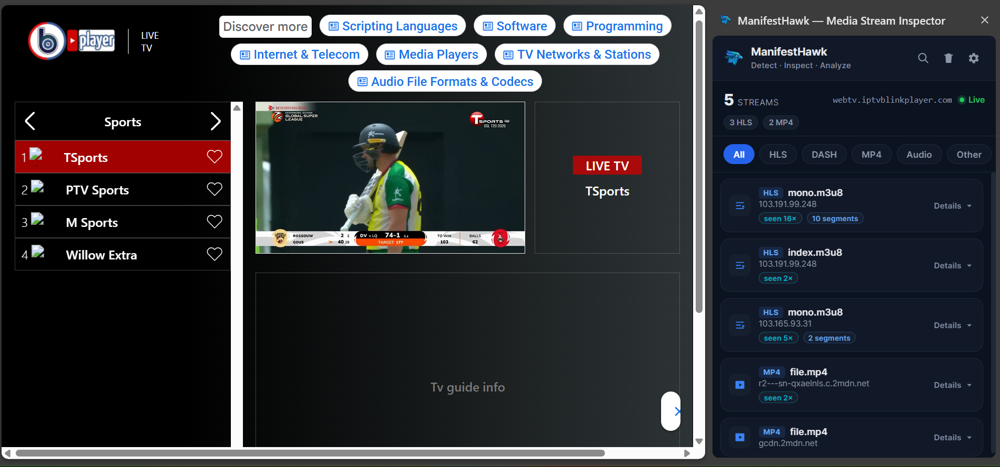
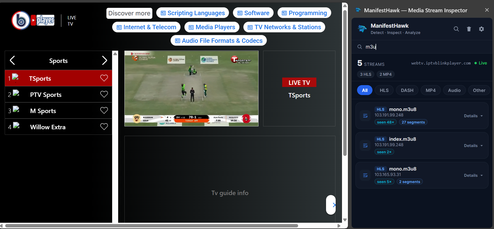
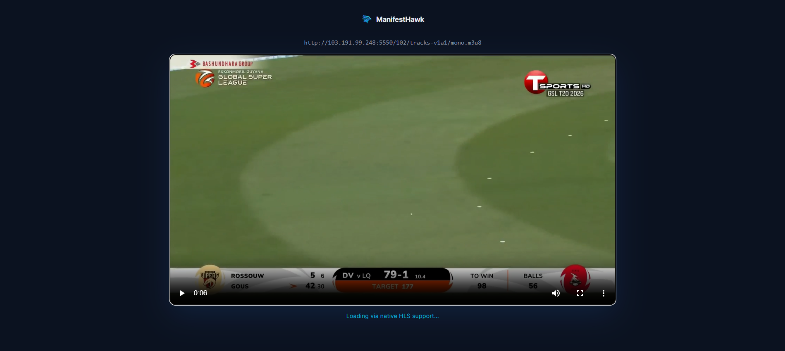
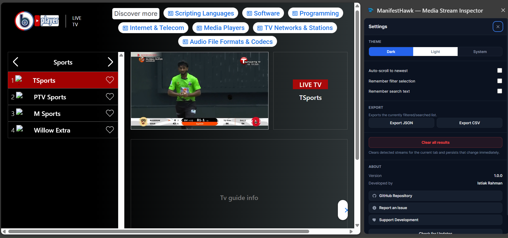

<div align="center">

# ManifestHawk

### Detect • Inspect • Analyze

**A Chrome extension that finds, classifies, and lets you inspect HLS, DASH, MP4, audio, and RTMP media streams on any page — live, deduplicated, and segment-aware, in a stable side panel.**

[](CHANGELOG.md)
[](#installation)
[](#permissions)
[](LICENSE)
[](https://github.com/istiakrahman15/ManifestHawk/stargazers)
[](https://github.com/istiakrahman15/ManifestHawk/issues)
[](https://github.com/istiakrahman15/ManifestHawk/commits)

If ManifestHawk is useful to you, consider **starring the repository** — it helps other developers find it.

</div>

---

## Screenshots

> Screenshots below are placeholders and will be updated as new releases ship.

| Home | Search |
|:---:|:---:|
|  |  |

| Preview | Settings |
|:---:|:---:|
|  |  |

---

## Features

### 📡 Media Detection
- Passive, per-tab network capture — no manual scanning required
- Classifies HLS (`.m3u8`), DASH (`.mpd`), MP4, audio, and RTMP streams
- `Content-Type` sniffing catches manifests served without a matching file extension (common behind CDNs / signed-URL proxies)
- DOM fallback scan inspects `<video>`, `<audio>`, and `<source>` elements for players that set `src` via JavaScript without a plain network request

### 🧩 Deduplication & Grouping
- The same manifest re-requested (token refresh, cache-busting query params, live-playlist polling) updates **one record** with a request counter — it never spams the list
- `.ts` / `.m4s` segments are grouped under their parent manifest instead of listed individually

### 🔎 Search & Filtering
- Instant, debounced search across filename, hostname, URL, and stream type
- One-click category filters (HLS / DASH / MP4 / Audio / Other)
- Filter and search state combine seamlessly

### ▶️ Preview
- In-extension preview player: HLS via `hls.js`, DASH via `dash.js`, native playback for MP4 and audio
- Playback libraries are loaded **on demand**, only for the stream type being previewed

### 📤 Export
- Export the current (filtered/searched) view to **JSON** or **CSV**
- One-click **Copy URL**
- One-click generated **ffmpeg command** for any stream

### ⚡ Performance
- Live-updating side panel driven by throttled push updates from the background service worker — **no polling, no flicker**
- Survives tab switches without losing state
- Per-tab capture state persists across Manifest V3 service-worker restarts via `chrome.storage.session`

### ⚙️ Settings
- Theme: Dark / Light / System
- Remember last filter and/or last search
- Clear results for the current tab, or clear everything

### 🔒 Security & Privacy
- No captured data ever leaves your device
- The only outbound request ManifestHawk makes on its own is the optional **Check for Updates** call to the GitHub Releases API
- No remote code execution — every script ships inside the extension package, per Manifest V3 requirements

---

## Why ManifestHawk?

Most media-stream inspectors are either heavyweight DevTools plugins or blunt "list every network request" tools that bury the manifest you actually care about under hundreds of segment requests.

ManifestHawk was built around a few specific priorities:

- **Developer experience first** — one manifest, one row, with request counts and segment counts folded in instead of noise.
- **Performance by default** — push-based updates instead of polling, on-demand loading of playback libraries, and a debounced UI so the panel stays smooth even on high-churn pages.
- **Minimal, honest permissions** — every permission in the manifest is used for a specific, documented feature (see [Permissions](#permissions) below) — nothing is requested "just in case."
- **A modern, stable UI** — a side panel instead of a popup, so it doesn't blink out of existence when you switch tabs or click elsewhere.
- **Reliable inspection, not guesswork** — extension-based, `Content-Type`-aware detection catches streams that URL-pattern-only tools miss.

---

## Installation

ManifestHawk is not yet on the Chrome Web Store — install it as an unpacked extension:

### 1. Get the source

**Option A — Clone:**
```bash
git clone https://github.com/istiakrahman15/ManifestHawk.git
```

**Option B — Download ZIP:**
Go to the [repository](https://github.com/istiakrahman15/ManifestHawk), click **Code → Download ZIP**, then extract it.

### 2. Load it into Chrome

1. Open `chrome://extensions`
2. Enable **Developer mode** (top-right toggle)
3. Click **Load unpacked**
4. Select the extracted/cloned `ManifestHawk` folder

ManifestHawk's icon will appear in your toolbar.

---

## Usage

1. **Click the ManifestHawk icon** in your toolbar — this opens the side panel.
2. **Play media** on the current page (or navigate to a page that's already streaming). Detected streams appear live.
3. **Search or filter** to narrow down the list by type, filename, or hostname.
4. **Expand a card** to see the full URL, first/last-seen time, and available actions:
   - **Copy URL**
   - **Open** — preview it in-extension
   - **Download** — save it via Chrome's downloader
   - **ffmpeg cmd** — copies a ready-to-run `ffmpeg -i "..." -c copy output.mp4` command
5. **Export** the current view to JSON or CSV from the Settings panel.
6. **Check for Updates** from the About section any time.

---

## Permissions

| Permission | Why it's needed |
|---|---|
| `webRequest` | Observe request URLs and response `Content-Type` headers to classify media streams. |
| `webNavigation` | Detect full-page navigations so stale, previous-page data is cleared. |
| `tabs` | Track the active tab and open the preview player / links in a new tab. |
| `storage` | Persist per-tab captures across service-worker restarts and save user settings. |
| `downloads` | Power the Download and Export actions. |
| `sidePanel` | Show ManifestHawk as a side panel instead of a popup. |
| `host_permissions: <all_urls>` | Media requests can be made to any origin — narrowing this would silently break detection on many sites. |

**No data collection.** ManifestHawk does not send any captured data off your device. The only outbound request it makes on its own is the optional **Check for Updates** call to the GitHub Releases API.

---

## Project Structure

```
ManifestHawk/
├── manifest.json              Manifest V3 configuration
├── background.js              Service worker — capture, classify, dedupe, persist, push updates
├── content.js                 DOM fallback scan (video / audio / source elements)
├── sidepanel.html
├── sidepanel.js                Side panel UI — list, filters, search, settings, export
├── sidepanel.css
├── player.html
├── player.js                  In-extension preview player (lazy-loads hls.js / dash.js)
├── libs/                      Bundled hls.js and dash.js
├── icons/                     Toolbar and store icons
├── CHANGELOG.md
├── RELEASE_NOTES.md
└── LICENSE
```

| Path | Purpose |
|---|---|
| `background.js` | The persistent brain of the extension. Watches `chrome.webRequest`, classifies and deduplicates streams per tab, and pushes throttled updates to the side panel. |
| `content.js` | Runs on every page as a fallback: scans the DOM for `<video>`/`<audio>`/`<source>` elements whose `src` was set directly by page JavaScript. |
| `sidepanel.*` | The entire user-facing UI: stream list, search, filters, dashboard stats, settings, and export. |
| `player.*` | A minimal, standalone preview page opened in a new tab, capable of playing HLS/DASH/MP4/audio. |
| `libs/` | Third-party playback libraries (`hls.js`, `dash.js`), bundled locally — no remote script loading. |
| `icons/` | Extension icons at all required sizes. |

---

## Verified Features

Every item below was manually re-verified as part of the v1.0.0 release process:

- [x] Capture (network + DOM fallback), deduplication, and segment grouping
- [x] Side panel: live push updates, tab-switch handling, no polling
- [x] Search (debounced), filters, and combined filter + search state
- [x] Copy URL, Open (preview player), Download, ffmpeg command
- [x] Export to JSON / CSV
- [x] Settings: theme (dark / light / system), remember-filter, remember-search, clear all
- [x] Update checker against the GitHub Releases API, with a request timeout
- [x] About panel and all outbound links (Repository / Issues / Support)
- [x] Manifest V3 compliance, minimal permissions, no remote code

---

## Known Limitations

- **RTMP detection is opportunistic.** Chrome's network stack generally doesn't expose native `rtmp://` traffic to extensions, so ManifestHawk mainly catches RTMP URLs surfaced indirectly (for example, embedded in a page's JavaScript or JSON).
- **No virtual scrolling.** The stream list is a plain DOM list, capped at 500 records per tab. Extremely long-lived, high-churn pages won't scale past that cap.

---

## Roadmap

| Milestone | Focus |
|---|---|
| **v1.0** | ✅ Stable Chrome release — core detection, side panel, preview, export, settings |
| **v1.1** | Performance improvements |
| **v1.2** | Additional UX improvements |
| **Future** | Firefox support (planned after the Chrome build reaches maturity) |

This roadmap reflects current intent, not commitments — features are added deliberately and only once they meet the same quality bar as v1.0.

---

## FAQ

**Does ManifestHawk collect data?**
No. All processing happens locally in your browser. Nothing captured is ever sent anywhere. The one exception is an optional, user-initiated "Check for Updates" call to the GitHub Releases API.

**Does it work offline?**
ManifestHawk only detects media streams that a page actually requests, so it needs the page itself to load content over the network. The extension has no other online dependency — the update check is optional and only runs when you click the button.

**Does it support Firefox?**
Not yet. Firefox support is on the [roadmap](#roadmap) for after the Chrome build matures. There's no timeline yet.

**Why doesn't every stream preview?**
Browsers can't play RTMP natively, so RTMP entries can't be previewed in-browser — use the generated ffmpeg command or an external player like VLC instead. Some MP4/audio URLs may also fail to preview if the source requires authentication headers the preview player doesn't send.

---

## Contributing

Contributions are welcome — bug reports, fixes, and thoughtful improvements alike.

1. **Open an issue first** for anything beyond a small fix, so the approach can be discussed before you invest time.
2. **Fork** the repository and create a feature branch from `main`.
3. Keep changes **focused** — one concern per pull request.
4. Match the existing code style (no build step; plain, dependency-free JS/HTML/CSS).
5. **Don't add new permissions** without discussing the justification in an issue first — see [Permissions](#permissions) for the bar every existing one meets.
6. Test your change as an unpacked extension before opening a PR: verify capture, the side panel, preview, search/filters, export, and settings all still behave correctly.
7. Open a pull request with a clear description of what changed and why.

---

## Support

- 🐞 **Found a bug?** [Open an issue](https://github.com/istiakrahman15/ManifestHawk/issues)
- 💡 **Have a feature request?** [Open an issue](https://github.com/istiakrahman15/ManifestHawk/issues) and tag it as a feature request
- ⭐ **Like the project?** [Star the repository](https://github.com/istiakrahman15/ManifestHawk)
- ☕ **Want to support development?** [supportkori.com/istiakrahman15](https://www.supportkori.com/istiakrahman15)

---

## Credits

**Developed and maintained by [Istiak Rahman](https://github.com/istiakrahman15)**

- **Repository:** [github.com/istiakrahman15/ManifestHawk](https://github.com/istiakrahman15/ManifestHawk)
- **Support:** [supportkori.com/istiakrahman15](https://www.supportkori.com/istiakrahman15)

---

## License

Released under the [MIT License](LICENSE).

---

<div align="center">

**Built with care for developers.**

If ManifestHawk helps you, consider giving the repository a ⭐

</div>
